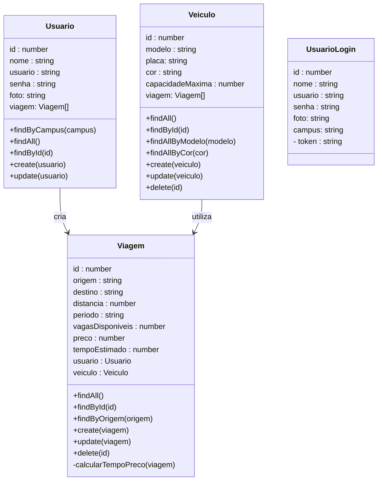
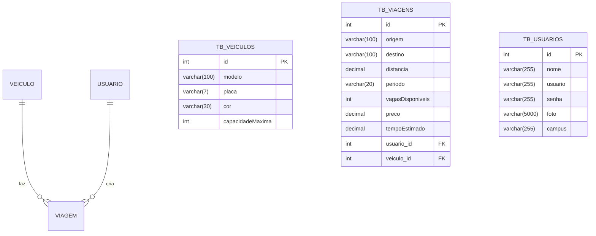

# Astra Corridas Compartilhadas - Backend


<div align="center">
      
  
  
  
  
  
  
</div>


## 1. Descrição

Este projeto é uma plataforma de caronas/viagens compartilhadas que busca oferecer uma experiência mais fácil, intuitiva e segura para os usuários.


------

## 2. Sobre esta API

Esta API REST foi desenvolvida utilizando NestJS e TypeScript e integração a um banco de dados MySQL.

Ela é responsável por gerenciar os dados da aplicação de caronas compartilhadas, permitindo a criação, consulta, atualização e remoção de informações através de endpoints HTTP.

A API segue a arquitetura modular proposta pelo NestJS, organizando o código em controllers, services e módulos para facilitar a manutenção e escalabilidade do projeto.

### 2.1. Principais Funcionalidades

1. Criar uma Viagem, consultar e atualizar suas informações.

2. Cadastrar um Usuário, indicar o campus universitario, visualizar as informações do usuário e gerenciar suas viagens.

3. Cadastrar um Veículo, selecionar um Veículo para uma viagem e visualizar os veículos disponíveis para condução.

------

## 3. Diagrama de Classes

O diagrama abaixo representa a estrutura lógica das entidades da aplicação e seus relacionamentos dentro da API.



------


## 4. Diagrama Entidade-Relacionamento (DER)

O DER representa como os dados estão organizados no banco relacional e como as entidades se relacionam.



------

## 5. Tecnologias utilizadas

| Item                         | Descrição                         |
| ---------------------------- | --------------------------------- |
| **Servidor**                 | Node JS                           |
| **Linguagem de programação** | TypeScript                        |
| **Framework**                | Nest JS                           |
| **Arquitetura**              | Modular + REST                    |
| **ORM**                      | TypeORM                           |
| **Banco de dados**           | MySQL                             |
| **Autenticação**             | Passport                          |
| **Validação**                | class-validator + class-transform |
| **Testes**                   | Insomnia                          |

------


## 6. Arquitetura do Projeto

O projeto foi desenvolvido utilizando a arquitetura modular proposta pelo **NestJS**, promovendo organização, escalabilidade e facilidade de manutenção do código.

Cada domínio da aplicação é isolado em um módulo próprio, contendo suas responsabilidades bem definidas:

* **Controller** → recebe e trata requisições HTTP
* **Service** → contém as regras de negócio
* **Entity** → representa as tabelas do banco de dados
* **Repository/ORM** → comunicação com o banco (via TypeORM)

Essa separação facilita testes, evolução do sistema e reutilização de código.


## 7. Estrutura de Pastas

A organização segue o padrão recomendado pelo NestJS:

```bash
📦src
 ┣ 📂auth
 ┣ 📂usuario
 ┣ 📂veiculo
 ┣ 📂viagem
 ┣ 📜app.controller.ts
 ┣ 📜app.module.ts
 ┣ 📜app.service.ts
 ┗ 📜main.ts
```

### Organização por módulo

Exemplo:

```bash
📦usuario
 ┣ 📂controllers
 ┃ ┗ 📜usuario.controller.ts
 ┣ 📂entities
 ┃ ┗ 📜usuario.entity.ts
 ┣ 📂services
 ┃ ┗ 📜usuario.service.ts
 ┗ 📜usuario.module.ts
```

Esse padrão permite crescimento do sistema sem acoplamento excessivo entre funcionalidades.

## 8. Fluxo de Autenticação (JWT)

A autenticação da API utiliza **JSON Web Token (JWT)** para proteger rotas sensíveis.

### Fluxo geral:

1. O usuário realiza login informando credenciais
2. A API valida os dados
3. Um token JWT é gerado
4. O cliente envia o token no header das próximas requisições:

```http
Authorization: Bearer TOKEN
```

5. Os Guards do NestJS validam o token antes de permitir acesso às rotas protegidas.

Esse modelo é amplamente utilizado em aplicações modernas por ser:

* Stateless
* Escalável
* Compatível com APIs REST

---

## 9. Validação de Dados

A aplicação utiliza:

* `class-validator`
* `class-transformer`

para garantir integridade dos dados recebidos pela API.

Exemplo conceitual:

* Campos obrigatórios são verificados automaticamente
* Tipos inválidos são rejeitados antes da regra de negócio
* Respostas de erro seguem padrão HTTP

Isso reduz erros e aumenta a confiabilidade da API.


---

## 10. Boas Práticas Aplicadas

Durante o desenvolvimento foram aplicados conceitos utilizados em projetos reais:

* Organização modular do NestJS

* Separação entre controller e regras de negócio

* Tipagem forte com TypeScript

* Padronização REST

* Autenticação baseada em token

* Estrutura preparada para escalabilidade

  

---

## 11. Diferenciais Técnicos

Este projeto demonstra competências importantes para desenvolvimento backend moderno:

✅ Construção de API REST com NestJS
✅ Arquitetura modular escalável
✅ Autenticação JWT
✅ Modelagem relacional (Usuário → Viagem ← Veículo)
✅ Integração com banco de dados MySQL via TypeORM
✅ Validação automática de dados com class-validator
✅ Criptografia de senha utilizando Bcrypt
✅ Implementação de regras de negócio no backend (cálculo automático de preço e tempo estimado da viagem)
✅ Uso profissional de TypeScript no backend


---

## 12. Requisitos

Para executar o projeto localmente:

- Node.js 18+

- npm

- MySQL

- Insomnia

  

------

## 13. Configuração e Execução

1. Clone o repositório `https://github.com/grupo6-js13/corridacompartilhada_backend`

2. Instale as dependências: `npm install`

3. Configure o banco de dados no arquivo `app.module.ts`

4. Execute a aplicação: `npm run start:dev`

   

## 14. Autores

**Orbyte - Onde as ideias orbitam em torno de conhecimento e tecnologia**

🔗 **GitHub:** https://github.com/grupo6-js13/

🔗 **E-mail:** grupo6js13@gmail.com 

Projeto desenvolvido para **aprendizado contínuo**, **demonstração técnica** e **portfólio profissional**.